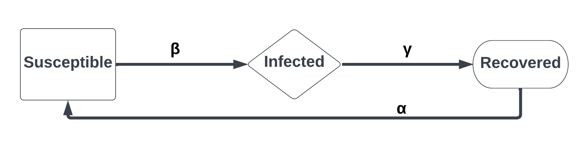

```{r, include = FALSE}
knitr::opts_chunk$set(
  collapse = TRUE,
  comment = "#>"
)
```

```{r setup, echo=FALSE}
library(whitetailedSIRS)
```

## Welcome to whitetailedSIRS!

The goal of this package is to provide source code and functionality for projecting outbreaks of SARS-CoV-2 in wild and captive white-tailed deer. Since the detection of SARS-CoV-2 in late 2019 and the ensuing Covid-19 pandemic, various monitoring efforts have documented active infections in white-tailed deer populations across North America. Multiple spillover events from humans to deer are the attributed source of these infections, and there is growing evidence that spillback from deer to humans is possible and has occurred. Given widespread detection of past and active infections in deer, and the zoonotic potential for SARS-CoV-2 to return to human populations after time in a non-human host, there is great interest in better understanding outbreak dynamics in white-tailed deer. This package was developed to (1) describe the degree of introduction and spread of SARS-CoV-2 in simulated white-tailed deer populations, (2) estimate average prevalence, the cumulative proportion of deer infected, and the probability of long-term persistence during these simulations, and (3) allow users to simulate different management interventions and estimate impacts in outbreak dynamics.

In it's current form, whitetailedSIRS vignettes support two manuscripts detailing the epidemiology of SARS-CoV-2 in white-tailed deer (Rosenblatt et al. In Prep) and how various decision alternatives could influence outbreak dynamics in deer herds (Cook et al. In prep). To learn more about the rationale and analytical approaches used, we strongly suggest users read these two paper. Users can then uses this package and its vignettes to develop their own epidemiological simulations. With version 1.0.0, we provide useful functions and workflow suggestions, and encourage users to develop their own applications. Future versions will grow with tools to allow quick comparisons under a Structured-Decision-Making (SDM) framework.

## General Approach

The foundational concept to this package are Susceptible-Infected-Recovered (SIR) epidemiological models. In these models, individuals can be (S)usceptible to infection by SARS-CoV-2, (I)nfected with SARS-CoV-2 and therefore infectious to other individuals, and (R)ecovered individuals that are no longer infections and benefit from immunity from reinfection. Individuals transition from S to I compartments based on various transmission risks ($\beta$), and from I to R compartments based on how long individuals take to mount an immune response and cease being infectious ($\gamma$). In the case of SARS-CoV-2 in white-tailed deer, there is an added transition from R to S compartments due to the waning of acquired immunity from a previous infection ($\alpha$). Therefore, we will be referring to an ***SIRS*** epidemiological model in this package to incorporate the detail of temporary immunity (Figure 1).

**Figure 1:**

```{r, echo=FALSE, out.width = "500px", fig.align="center"}

```

SIRS ordinary differential equations (ODE) work behind the scenes to calculate how a disease spreads in a given simulation. There are two included with this package to support the manuscripts previously mentioned, including: 

* `simple_sirs()` - an SIRS ode equation for projecting S, I, and R compartment sizes on a daily basis

* `simple_sirs_with_cumulative()` - an SIRS ode equation for projecting S, I, and R compartment sizes on a daily basis, which calculating the cumulative proportion of individuals infected over the course of a simulation.

These two sirs equations differ in their applications, and are explored in greater detail in the [sir_model_description vignette](sir_model_description.html).

## Workflow
The bulk of the functions and code in the whitetailedSIRS package deal with estimating various parameters required to calculate transmission probabilities, recovery rates, and immunity loss rates. These derived probabilities and rates are integrated into the ODE equations, allowing the calculation outbreak characteristics. The user will see a typical workflow in the calculations of these rates:

* Step 1: Draw parameter estimates from expert elicitation sources (for parameters without empirical estimates)
   +  `draw_elicitation_samples()` draws user-defined number of random samples from parametric error distributions for a set of parameters. These error distributions are characterized from distributions aggregated across multiple experts, detailed in Rosenblatt et al. In Prep.
   + `get_EE_param_vals()` extracts the random samples drawn with `draw_elicitation_samples()` for a particular parameter.
* Step 2: Calculate derived parameters (e.g. animal contact rates, infection probabilities)
   + `calc_contact_rate()` uses established an contact rate model to calculate deer-deer proximity rates for wild deer and captive deer kept in wild densities. These proximity rates are based on assumptions of habitat availability, deer density, and effects of density-dependence.
   + `calc_sigma_aero()` calculates the probability of infection from SARS-CoV-2 transmission via aerosols. This function considers duration of contact and viral emission into this probability calculation, and can be used for deer-to-deer and human-to-deer contexts.
   + `cal_sigma_dc()` calculates the probability of infection from SARS-CoV-2 transmission via fluids transferred upon contact. This function considers viral load and volume transferred into this probability calculation, and can be used for deer-to-deer and human-to-deer contexts.
   + `alternative()` calculates the final set of derived parameters to be integrated with the ODE equations such as transmission risks ($\beta$), recovery rates ($\gamma$), and immunity loss rates ($\alpha$). This function is run last during this step, and the output contains all parameter values needed for step 3.
* Step 3: Set starting population conditions and run simulation
   + `initial_compartments()` defines the starting proportion of deer in each compartment, in both wild and captive populations. If one population is not of interest to the user, they can set all compartments to 0 for that population.
   + `run()` takes the initial compartments (output from `initial_compartments()`), the SIR ODE equations (established by `simple_sirs()` and `simple_sirs_with_cumulative()`), and epidemiological parameters (output object from `alternative()`), and projects daily compartment sizes given these preconditions.
      
This workflow can integrate multiple scenarios or sets of parameters, and can be run in an iterative manner that explores uncertainty for various parameter sets.

## Outputs
In this current version (1.0.0), reported metrics to describe these outbreaks are derived in vignettes, and have yet to be integrated into functions. Generally speaking, the user will see the following metrics to describe aspects of a simulated SARS-CoV-2 outbreak in white-tailed deer:

* Force-of-Infection: Degree of introduction from humans to deer
* Basic reproductive Number ($R_0$): Number of secondary infections resulting from an infected deer
* Average daily prevalence: Average daily proportion of deer in the infected compartment
* Persistence: Logical (TRUE/FALSE) value indicating if >0.1% of deer are infected at ODE system equilibrium.
* Incidence proportion: The total proportion of a population that were infected during a simulation.

## Next Steps
Next, we can look at a description of the epidemiological model used to explore outbreak dynamics in simulated white-tailed deer populations. [Click here to advance to the SIRS model description vignette.](sir_model_description.html)

## Literature Cited
* Cook, J.D., E. Rosenblatt, G.V. Direnzo, E.H.C. Grant, B.A. Mosher, F. Arce, S. Christensen, R. Ghai, M.C. Runge. In Prep. Using decision science to evaluate the risk and management of SARS-CoV-2 zoonotic transmission between humans and white-tailed deer.

* Rosenblatt, E., J.D. Cook, G.V. Direnzo, E.H.C. Grant, F. Arce, K. Pepin, F.J. Rudolph, M.C. Runge, S. Shriner, D. Walsh, B.A. Mosher. In Prep. Epidemiological modeling of SARS-CoV-2 in white-tailed deer (Odocoileus virginianus) reveals conditions for introduction and widespread transmission.
