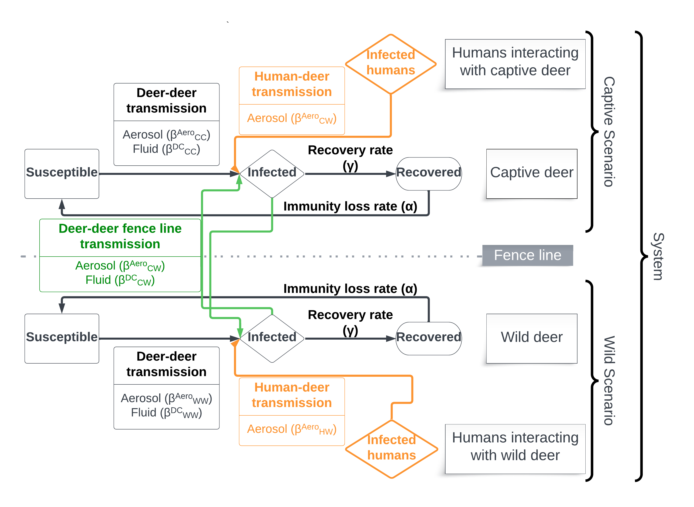

```{r, include = FALSE}
knitr::opts_chunk$set(
  collapse = TRUE,
  comment = "#>"
)
```

```{r setup}
library(whitetailedSIRS)
```

[Previous page (Introduction)](Introduction.html)

[Next page (Example Analysis)](example_values.html)

## Introduction

This vignette discusses the series of equations that allow us to explore outbreak dynamics of SARS-CoV-2 in a simulated white-tailed deer population. Several functions are included to do these calculations for you, and are referenced in the text below.

## Topics covered in this vignette

-   SIR ODE equation introduction

-   SIR ODE equations for white-tailed deer in wild and captive settings

-   Calculation of transmission risk through aerosols and fluids

-   Tracking cumulative infections

## SIRS ODE equations

In this package, we explore two direct exposure pathways in a Susceptible-Infected-Recovered-Susceptible model (SIRS) that simulates infection dynamics through time. The basic form of an SIRS model is in the following set of ordinary differential equations (ODE; eqn 1-3):

::: {style="font-size: 85%;"}
```{=tex}
\begin{align}
\tag{1}
\tfrac{ds}{dt} &= - \beta si + \alpha r \\

\tag{2}
\tfrac{di}{dt} &= \beta si - \gamma i \\

\tag{3}
\tfrac{dr}{dt} &= \gamma i - \alpha r \\
\end{align}
```
:::

where $s$ is the proportion of susceptible individuals, $i$ is the proportion of infected individuals with SARS-CoV-2, and $r$ is the proportion of recovered individuals; thus, $s+i+r = 1$ . $\beta$ is the transmission rate, $\gamma$ is the recovery rate, and $\alpha$ is the immunity loss rate (inverse of time to loss of immunity; Figure 1). $\beta$ is the product of a contact rate ($c$) and probability of infection ($\nu$; eqn. 4).

```{=tex}
\begin{align}
\tag{4}
\beta = c \cdot \nu
\end{align}
```
## SIRS ODE equations for wild and captive white-tailed deer

We can take these basic SIRS ODE equations and modify them to describe more complex epidemiological processes. This package uses a general SIRS ODE equation set that calculates outbreak dynamics within and between wild and captive deer (Figure 1; Rosenblatt et al. In Prep.). In this system, the wild and captive populations have their own SIRS cycle. Introduction occurs through an initial exposure, or through continued exposure from infected humans (orange diamond and arrow). This design also can incorporate user-defined fence line transmission rates that allow SARS-CoV-2 to transfer between wild and captive deer (green box and arrows).

```{r, echo=FALSE, out.width = "700px", fig.align="center", fig.cap="Figure 1: A conceptual illustration of the two seperate SIRS processes for wild and captive white-tailed deer, linked through fenceline interactions and exposed to infected humans."}

```

The SIRS ODE equations for this design are stored in a primary function in the package, called `whitetailedSIRS::simple_sirs()`. The derivation is detailed below (eqn. 5-10). In these equations, transmission rates ($\beta$) are denoted with subscripts that indicate the host-recipient relationship, including human-to-wild deer (HW), human-to-captive deer (HC), wild deer-to-wild deer (WW), captive deer-to-wild deer (CW, this parameter is bidirection), and captive deer-to-captive deer (CC). $\beta$ superscripts refer to the transmission route of the virus, including transmission via aerosols (Areo) and via fluid exchanged with physical contact (DC). As in equations 1-3 $\gamma$ is the recovery rate and $\alpha$ is the immunity loss rate. There are several assumptions behind these parameters discussed in Rosenblatt et al. In Prep..

### Wild deer SIRS ODE equations

::: {style="font-size: 85%;"}
```{=tex}
\begin{align}
\tag{5}
\frac{ds_W}{dt} =
               \alpha r_W - 
               s_W (\beta_{WW}^{Aero} i_W + \beta_{WW}^{DC} i_W + 
               \beta_{CW}^{Aero} i_C + \beta_{CW}^{DC} i_C + \beta_{HW}^{Aero} i_H)
\end{align}
```
:::

```{r eq5}
#| eval: false

# equation 5 
 dS_wild <- alpha_immunity * R_wild -
         (S_wild * ((beta_aero_ww * I_wild) + (beta_dc_ww * I_wild) +
                       (beta_aero_cw * I_captive) + (beta_dc_cw * I_captive) +
                       (beta_aero_hw * I_human)))

```

::: {style="font-size: 85%;"}
```{=tex}
\begin{align}

\tag{6}

\frac{di_W}{dt} = 
               s_W (\beta_{WW}^{Aero} i_W + \beta_{WW}^{DC} i_W + 
               \beta_{CW}^{Aero} i_C + \beta_{CW}^{DC} i_C + \beta_{HW}^{Aero} i_H)
                - \gamma i_W
                
\end{align}
```
:::

```{r eq6}
#| eval: false

# equation 6 
dI_wild <- (S_wild * ((beta_aero_ww * I_wild) + (beta_dc_ww * I_wild) +
                               (beta_aero_cw * I_captive) + (beta_dc_cw * I_captive) +
                               (beta_aero_hw * I_human))) -
         (gamma_recov * I_wild)

```

::: {style="font-size: 85%;"}
```{=tex}
\begin{align}
\tag{7}
\frac{dr_W}{dt} = \gamma i_W - \alpha r_W
\end{align}
```
:::

```{r eq7}
#| eval: false

# equation 7 
dR_wild <- (gamma_recov * I_wild) -
         (alpha_immunity * R_wild)

```

### Captive deer SIRS ODE equations

::: {style="font-size: 85%;"}
```{=tex}
\begin{align}
\tag{8}
\frac{ds_C}{dt} =
               \alpha r_C - 
               s_C (\beta_{CC}^{Aero} i_C + \beta_{CC}^{DC} i_C + 
               \beta_{CW}^{Aero} i_W + \beta_{CW}^{DC} i_W + \beta_{HC}^{Aero} i_H)
\end{align}
```
:::

```{r eq8}
#| eval: false

# equation 8 
dS_captive <- alpha_immunity * R_captive -
         (S_captive * ((beta_aero_cc * I_captive) + (beta_dc_cc *I_captive) +
                          (beta_aero_cw * I_wild) + (beta_dc_cw * I_wild) +
                          (beta_dc_hc * I_human)))
         

```

::: {style="font-size: 85%;"}
```{=tex}
\begin{align}
\tag{9}
\frac{di_C}{dt} = 
               s_C (\beta_{CC}^{Aero} i_C + \beta_{CC}^{DC} i_C + 
               \beta_{CW}^{Aero} i_W + \beta_{CW}^{DC} i_W + \beta_{HW}^{Aero} i_H)
\end{align}
```
:::

```{r eq9}
#| eval: false

# equation 9 
dI_captive <- (S_captive * ((beta_aero_cc * I_captive) + (beta_dc_cc *I_captive) +
                                     (beta_aero_cw*I_wild) + (beta_dc_cw * I_wild) +
                                     (beta_dc_hc * I_human))) -
         (gamma_recov * I_captive)
```

::: {style="font-size: 85%;"}
```{=tex}
\begin{align}
\tag{10}
\frac{dr_C}{dt} = \gamma i_C - \alpha r_C
\end{align}
```
:::

```{r eq10}
#| eval: false

# equation 10 
dR_captive <- (gamma_recov * I_captive) -
         (alpha_immunity * R_captive)

```

## $\beta$ Definitions

Several $\beta$ values are included in the model to incorporate various direct transmission pathways between wild deer, captive deer, and humans. The basic structure of these $\beta$ values is the product of a proximity or contact rate and an infection probability given contact. Superscripts indicate the mode of transmission, including: "Aero", to indicate transmission by aerosols; and "DC" to indicate transmission via fluid exchanged through direct contact. Subscripts indicate the host-recipient pair for a particular transmission risk parameter: transmission between wild deer (WW); transmission between captive deer and wild deer (CW); transmission between captive deer (CC); transmission between human to wild deer (HW); and transmission between human to captive deer (HC).

### Aerosol Transmission

Aerosolized transmission rates ($\beta^{Aero}$) are the product of the rate that a susceptible individual enters shared airspace with an infected individual (within 1.5m) and the probability of infection given proximity. Below we detail deer-deer proximity rates in the wild, captivity, and across fence lines separating these settings (Section 2.3.1.1), human-deer proximity rates in wild and captive environments (Section 2.3.1.2), and infection probability given proximity (Section 2.3.1.3). We then build transmission rates ($\beta^{Aero}$) between deer and between humans and deer in various settings (Section 2.3.1.4).

#### Deer-deer proximity rates

*Wild deer* - We define proximity ($\omega_{ij}$) as the frequency per day that host i and recipient j are within 1.5 m of each other. We estimate the proximity rate for wild deer, ($\omega_{ww}$), based on a contact rate model developed by Habib et al. (2011) for chronic wasting disease in white-tailed deer that results in intermediate transmission that blends density-dependence and frequency-dependence. This formulation applies to deer-deer transmission in most scenarios, in cases with and without attractants (e.g., bait, supplemental feed). We also apply this model for captive circumstances that mimic natural conditions. It is given by:

::: {style="font-size: 85%;"}
```{=tex}
\begin{align}
\tag{11}
\omega_{ij} = \kappa \bigg( \frac{N_{W}^{1-q}}{A_{W}} \bigg) \cdot \rho_{attractant}
\end{align}
```
:::

where $\kappa$ is a scaling constant; $q$ is a concavity scaling constant of the density-contact rate relationship ranging from 0 -- 1, from density-dependence to frequency-dependence, respectively; $N_W$ is the total population size; $A_W$ is the area inhabited by the population; $\rho_{attractant}$ is the adjustment for the presence of an attractant.

In the whitetailedSIRS package, the function `calc_contact_rate` will handle this calculation.

```{r}
calc_contact_rate <- function(kappa,
                              N_w,
                              q,
                              A_w,
                              rho_attractant,
                              nsamples,
                              seed,
                              type_contact){

   contact_val <- kappa * (N_w^(1-q)/A_w) * rho_attractant
   return(contact_val)
}
```

*Captive deer* - The per capita rate of proximity between deer in captivity is unstudied and is likely highly dependent on facility type and practices. For lower density facilities that mimic natural densities and natural conditions we estimate proximity rates based on the calculation for wild populations (Eq. 11). We use expert-elicited estimates of deer proximity rates (proximity events per day) in higher intensity captive operations ($\omega_{CC}$).

*Fence line interactions* -- We estimate per capita proximity rates along fence lines separating wild and captive deer herds using multiple estimates derived from the literature ($\omega_{WC}$).

#### Human-deer proximity rates

*Human - wild deer proximity rates* -- Human-deer interactions are understudied in the literature, so we instead use expert elicitation to estimate the rate of proximity between humans and deer in wild conditions ($\omega_{HW}$). In our expert elicitation process we estimated human-deer proximity rates in two scenarios that differed only by human density and development, reflecting rural and suburban conditions.

*Human -- captive deer proximity rates* -- We used expert elicitation to estimate human-deer proximity rate in intensive captive facilities, reflecting a range of activities including operational tasks, routine veterinary tasks, and visitors interacting with captive animals. We used a general description to provide a general, initial estimate for this unstudied proximity rate ($\omega_{HC}$), while acknowledging that this rate is likely enterprise- and facility-specific.

#### Infection probability given proximity

The probability of infection ($\sigma^{Aero}$) given proximity is a function of the instantaneous dose received and a dose response relationship. To estimate the dose received by a susceptible individual in proximity to an infected individual, we model 1) the emission of SARS-CoV-2 from an infected individual, 2) the resulting concentration of SARS-CoV-2 in a designated airspace around an infected individual, considering virus emission and virus loss, and 3) the amount of SARS-CoV-2 inhaled by a susceptible individual given proximity to an infected individual. Most of these parameters exist in the literature focused on human SARS-CoV-2 infection and can be adopted here.

First, an infected individual emits SARS-CoV-2 at a particular rate ($ER_q$; quanta/hr) as the product of the viral load in its sputum ($C_{\nu}$; RNA copies/ml), a conversion factor ($C_i$; quanta/RNA copy), the inhalation/exhalation rate ($IR$; $m^3$/hr), and the exhaled droplet volume concentration ($V_d$; ml exhaled droplets/$m^3$ exhaled; Mikszewski et al. 2021).

::: {style="font-size: 85%;"}
```{=tex}
\begin{align}
\tag{12}
{ER}_q = C_{\nu} \cdot C_i \cdot {IR} \cdot V_d
\end{align}
```
:::

We can then model the instantaneous concentration of SARS-CoV-2 ($C$; quanta/$m^3$) well-mixed in the airspace around an infected individual emitting SARS-CoV-2 (${ER}_q$; quanta/hr) into a fixed volume ($V$; $m^3$), accounting for a loss rate (${IVRR}$; $hr^{-1}$) as the sum of air exchange (${AER}$; $hr^{-1}$), settling ($s$; $hr^{-1}$, and inactivation rates ($\lambda$; $hr^{-1}$; modified from Buonanno et al. 2020).

::: {style="font-size: 85%;"}
```{=tex}
\begin{align}
\tag{13}
C = \frac{{ER}_q}{{IVRR} \cdot V}
\end{align}
```
:::

where

::: {style="font-size: 85%;"}
```{=tex}
\begin{align}
\tag{14}
{IVRR} = {AER} + s + \lambda
\end{align}
```
:::

When a susceptible individual enters the contaminated airspace surrounding an infected individual, the dose ($Q_A$; quanta) is the product of the inhalation rate of the susceptible individual ($IR$; $m^3$/hr), the concentration of SARS-CoV-2 in the fixed volume ($C$; quanta/$m^3$), and the duration of time the susceptible individual stays within the contaminated airspace during a contact ($t_{contact}$; hr).

::: {style="font-size: 85%;"}
```{=tex}
\begin{align}
\tag{15}
Q = IR \cdot C \cdot t_{contact}
\end{align}
```
:::

The amount of SARS-CoV-2 inhaled by the susceptible deer ($Q_A$) is converted into a probability of infection using the Wells-Riley infection model (Equation 8). Under this model, the probability of an individual developing and sustaining an infection of SARS-CoV-2 is a function of the dose received (measured in quanta; $Q$) and a species-specific probability of infection from 1 quantum ($r$; $r_{human} = 1$ corresponds to 1 quantum causing infection in 63% of susceptible individuals; HID63). We use expert elicitation to estimate dose response relationship for white-tailed deer ($r_{deer}$).

::: {style="font-size: 85%;"}
```{=tex}
\begin{align}
\tag{16}
\sigma^{Aero} = 1 - e^{-rQ}
\end{align}
```
:::

The dose received and probability of infection are calculated for deer-deer and human-deer proximity events based on species-specific exhalation/inhalation rate, viral loads, dose response relationships, and various durations of proximity events for particular contexts.

In the whitetailedSIRS package, the function `calc_sigma_aero` will automate the calculation of infection probability.

```{r}
calc_sigma_aero <- function(AER,
                         s,
                         lambda,
                         C_nu,
                         C_i,
                         IR,
                         V_d,
                         V_air,
                         t_contact,
                         r) {
   
   # Calculate the viral particle loss rate as the sum 
   # of air exchange, settling rate, and inactivation
   IVRR <- AER + s + lambda
   
   # calculate emission rate of viral particles
   ER_q <- C_nu * C_i * IR * V_d
   
   # Calculate instantaneous concentration of viral particles.
   C_inst <- ER_q / (IVRR * V_air) #V_air is airspace volume
   
   # Calculate viral dose in quanta as product of 
   # inhalation rate, instantaneous concentration of viral particles
   # and the duration of the contact
   Q <- IR * C_inst * t_contact
   
   # Use Wells-Riley model to transform amount of virus inhaled
   # into a probability of infection via aerosol
   sigma_aero <- 1 - exp(-r * Q)
   
   return(sigma_aero)
}
```

#### Aerosol transmission rates ($\beta^{Aero}$)

Below are the various aerosol transmission rates used in the SIRS model. Parameter values are listed in Table 1 of Rosenblatt et al. In Prep.

Aerosol transmission between wild deer:

::: {style="font-size: 85%;"}
```{=tex}
\begin{align}
\tag{17}
\beta_{WW}^{Aero} = \kappa \bigg( \frac{N_{W}^{1-q}}{A_{W}} \bigg) \cdot \rho_{attractant} \cdot \sigma^{Aero}
\end{align}
```
:::

-   $\kappa$ = scaling constant (Section 2.1.1)
-   $q$ = concavity scaling constant (Section 2.1.1)
-   $N_W$ = Total wild population size (Section 2.1.1)
-   $A_W$ = Area inhabited by wild population (Section 2.1.1)
-   $\rho_{attractant}$ = proportional adjustment for attractants on the landscape (Section 2.1.1)
-   $\sigma^{Aero}$ = Probability of infection from aerosols (Section 2.1.3)

Aerosol transmission between captive deer:

::: {style="font-size: 85%;"}
```{=tex}
\begin{align}
\tag{18}
\beta_{CC}^{Aero} = \omega_{CC} \cdot \sigma^{Aero}
\end{align}
```
:::

-   $\omega_{CC}$ = Captivity proximity rate (Section 2.1.1)
-   $\sigma^{Aero}$ = Probability of infection from aerosols (Section 2.1.3)

Aerosol transmission between wild and captive deer across fence:

::: {style="font-size: 85%;"}
```{=tex}
\begin{align}
\tag{19}
\beta_{CW}^{Aero} = \omega_{WC} \cdot \sigma^{Aero}
\end{align}
```
:::

-   $\omega_{WC}$ = Fence line proximity rate between wild and captive deer (Section 2.1.1)
-   $\sigma^{Aero}$ = Probability of infection from aerosols (Section 2.1.3)

Aerosol transmission between humans and wild deer:

::: {style="font-size: 85%;"}
```{=tex}
\begin{align}
\tag{20}
\beta_{HW}^{Aero} = \omega_{HW} \cdot \sigma^{Aero}
\end{align}
```
:::

-   $\omega_{HW}$ = Proximity rate between humans and wild deer (Section 2.1.2)
-   $\sigma^{Aero}$ = Probability of infection from aerosols (Section 2.1.3)

Aerosol transmission between humans and captive deer:

::: {style="font-size: 85%;"}
```{=tex}
\begin{align}
\tag{21}
\beta_{HC}^{Aero} = \omega_{HC} \cdot \sigma^{Aero}
\end{align}
```
:::

-   $\omega_{HC}$ = Proximity rate between humans and captive deer (Section 2.1.2)
-   $\sigma^{Aero}$ = Probability of infection from aerosols (Section 2.1.3)

### Fluid Transmission

The transmission rate of SARS-CoV-2 via fluid transfer on direct contact ($\beta^{DC}$) is the product of the rate that a susceptible individual enters shared airspace with an infected individual (within 1.5m), the probability of the two individuals making physical contact, and the probability of infection given contact. We simply take the deer-deer proximity rates detailed above ($\omega_{ij}$) and multiply them by expert-elicited estimates of physical contact probability ($\epsilon^{DC}$) to determine the rate of physical contact, and by the probability of infection given transfer of 0.1 ml of contaminated fluid during physical contact ($\sigma^{DC}$). Below we detail the infection probability given physical contact (Section 2.2.1). We then build transmission rates ($\beta^{DC}$) between deer (Section 2.2.2). We consider this transmission pathway between deer, but not between human and deer.

#### Infection probability given physical contact

We use a Wells-Riley dose response model that estimates infection probability as a log-logistic function of dose ($d^{dc}$; plaque-forming units, PFU) and the dose-response function ($k$; Watanabe et al. 2010). The dose received is the product of a typical volume of sputum transferred given contact ($V^{DC}$) and the concentration of SARS-CoV-2 in sputum ($C_{\nu}$). We initially assume that at each contact 100$\mu$l of sputum is transferred between individuals making contact. We will adjust this volume across simulations to identify a volume threshold that rapidly increases transmission risk.

::: {style="font-size: 85%;"}
```{=tex}
\begin{align}
\tag{22}
\sigma^{DC} = 1 - e^{-((C_{v} \cdot V_{sputum} )/k)}
\end{align}
```
:::

In the `whitetailedSIRS package`, the function `calc_sigma_dc` will automate the calculation of infection probability from the transmission of fluid.

```{r}
# function for sigma_direct_contact

calc_sigma_DC<- function(V_DC, C_nu, pfu_conv, k){
   
   # calculate dose received as function of volume of sputum and viral particles concentration. There is an added parameter pfu_conv to convert RNA copies to plaque forming units, which is likely necessary given available parameter estimates.
   d_DC <- V_DC * C_nu * pfu_conv
   
   # calculate infection probability 
   sigma_DC <- 1 - exp(-d_DC/k)
   
   return(sigma_DC)
}
```

#### Fluid Transmission ($\beta^{DC}$)

Below are the various direct contact transmission rates used in the SIRS model. Parameter values are listed in Table 1 of Rosenblatt et al. In Prep.

*Direct contact transmission between wild deer:*

::: {style="font-size: 85%;"}
```{=tex}
\begin{align}
\tag{23}
\beta_{WW}^{DC} = kappa \cdot \bigg( \frac{N_W^{(1-q)}}{A_W} \bigg) \cdot \epsilon^{DC} \cdot \sigma^{DC}
\end{align}
```
:::

-   $\kappa$ = scaling constant (Section 2.1.1)
-   $q$ = concavity scaling constant (Section 2.1.1)
-   $N_W$ = Total wild population size (Section 2.1.1)
-   $A_W$ = Area inhabited by wild population (Section 2.1.1)
-   $\epsilon^{DC}$ = Probability of deer making direct contact (Section 2.2)
-   $\sigma^{DC}$ = Probability of infection from direct contact (Section 2.2.1)

Direct contact transmission between captive deer:

::: {style="font-size: 85%;"}
```{=tex}
\begin{align}
\tag{24}
\beta_{CC}^{DC} = \omega_{CC} \cdot \epsilon^{DC} \cdot \sigma^{DC} 
\end{align}
```
:::

-   $\omega_{CC}$ = Captivity proximity rate (Section 2.1.1)
-   $\epsilon^{DC}$ = Probability of physical contact (Section 2.2)
-   $\sigma^{DC}$ = Probability of infection from physical contact (Section 2.2.1)

Direct contact transmission between wild and captive deer along fence line (assuming possible):

::: {style="font-size: 85%;"}
```{=tex}
\begin{align}
\tag{25}
\beta_{CW}^{DC} = omega_{WC} \cdot \sigma^{DC} \cdot \nu^{DC}
\end{align}
```
:::

-   $\omega_{WC}$ = Fenceline contact rate between wild and captive deer (Section 2.1.1)
-   $\epsilon^{DC}$ = Probability of physical contact (Section 2.2)
-   $\epsilon^{DC}$ = Probability of infection from physical contact (Section 2.2.1)

### Function to calculate and organize betas and other SIR parameters

The function `whitetailedSIRS::alternatives()` is available to do all of these calculations for the user.

```{r}
alternative <- function(alpha_immunity = NULL, omega_ww = NULL, omega_cw = NULL, omega_cc = NULL, omega_hw = NULL, omega_hc = NULL, sigma_aero_deer_deer_wild = NULL, sigma_aero_deer_deer_captive = NULL, sigma_aero_deer_human_wild = NULL, sigma_aero_deer_human_capt = NULL, sigma_dc = NULL, sigma_dc_deer_deer = NULL, gamma_recov = NULL, I_human = NULL, boost = NULL)


   {list(
      alpha_immunity, #Duration of immunity (Section 1)
      beta_aero_ww = omega_ww * sigma_aero_deer_deer_wild, #Transmission risk, aerosols between wild deer (Section 2.1.4)
      beta_aero_cw = omega_cw * sigma_aero_deer_deer_wild, #Transmission risk, aerosols across fencelines (Section 2.1.4)
      beta_aero_cc = omega_cc * sigma_aero_deer_deer_captive, #Transmission risk, aerosols between captive deer  (Section 2.1.4)
      beta_aero_hw = omega_hw * sigma_aero_deer_human_wild, #Transmission risk, aerosols between humans and wild deer  (Section 2.1.4)
      beta_aero_hc = omega_hc * sigma_aero_deer_human_capt, #Transmission risk, aerosols between humans and captive deer  (Section 2.1.4)
      beta_dc_ww = omega_ww * sigma_dc * sigma_dc_deer_deer, #Transmission risk, fluid between wild deer (Section 2.2.2)
      beta_dc_cw = omega_cw * sigma_dc * sigma_dc_deer_deer, #Transmission risk, fluid across fencelines (Section 2.2.2)
      beta_dc_cc = omega_cc * sigma_dc * sigma_dc_deer_deer, #Transmission risk, fluid between captive deer (Section 2.2.2)
      gamma_recov = gamma_recov, #Recovery rate (Section 1)
      I_human = I_human, #Human prevalence (Section 1)
      boost = boost)} #Boost (See `whitetailedSIRS::Management_Alternatives_Systems` vignette for more details.)
```

## Outputs reported by whitetailedSIRS solving SIRS ODE equations

Several epidemiological metrics can be calculated using outputs from solved SIRS ODE equations. These metrics will be shown in more detail in following vignettes, but include:

-   Force-Of-Infection (FOI): The susceptible individuals infected per day

-   Basic reproductive number (R_{0}): The number of secondary infections caused by an infected deer over the course of its infection

-   Average daily prevalence in deer: The average proportion of deer infected during an outbreak

-   Probability of persistence beyond projection at ODE equilibrium (a deterministic point when SIRS compartment sizes no longer change)

-   Incidence proportion: The cumulative proportion of the population infected over the course of a projection. The modified `whitetailedSIRS::simple_sirs_with_cumulative()` has added ODE equations to calculate this sum. While the majority of the function is identical to `whitetailedSIRS::simple_sirs()`, there are two added lines:

```{r}
#| eval: false
cumulative_I_wild <- (S_wild * ((beta_aero_ww * I_wild) + (beta_dc_ww * I_wild) +
                                         (beta_aero_cw * I_captive) + (beta_dc_cw * I_captive) +
                                         (beta_aero_hw * I_human)))

cumulative_I_captive <- (S_captive * ((beta_aero_cc * I_captive) + (beta_dc_cc *I_captive) +
                                               (beta_aero_cw*I_wild) + (beta_dc_cw * I_wild) +
                                               (beta_aero_hc * I_human)))
```

These added lines equate to the following calculations:

::: {style="font-size: 85%;"}
```{=tex}
\begin{align}
\tag{26}
Cumulativeinfections_{W} =  \sum^{120}_{t=1} s_{t-1}(\beta^{Aero}_{WW} i_{W,t-1} + \beta^{DC}_{WW} i_{W,t-1} + \beta^{Aero}_{CW} i_{C,t-1} + \beta^{DC}_{CW} i_{C,t-1} + \beta^{Aero}_{HW} i_{H})
\end{align}
```
:::

::: {style="font-size: 85%;"}
```{=tex}
\begin{align}
\tag{27}
Cumulativeinfections_{C} = \sum^{120}_{t=1} s_{t-1}(\beta^{Aero}_{CC} i_{C,t-1} + \beta^{DC}_{CC} i_{C,t-1} + \beta^{Aero}_{CW} i_{W,t-1} + \beta^{DC}_{CW} i_{W,t-1} + \beta^{Aero}_{HC} i_{H})
\end{align}
```
:::

## Next Steps

With the overview of the SIRS ODE equations used to project SARS-CoV-2 outbreaks in white-tailed deer, and the various summary functions and metrics we use to characterize outbreaks, next we can [explore an example of the approach and function use to model an outbreak in a simulated population.](example_values.html)

Click [here](Introduction.html) to return to the vignette introducing the whitetailedSIRS package.

## Literature Cited
* Rosenblatt, E., J.D. Cook, G.V. Direnzo, E.H.C. Grant, F. Arce, K. Pepin, F.J. Rudolph, M.C. Runge, S. Shriner, D. Walsh, B.A. Mosher. In Prep. Epidemiological modeling of SARS-CoV-2 in white-tailed deer (Odocoileus virginianus) reveals conditions for introduction and widespread transmission.
